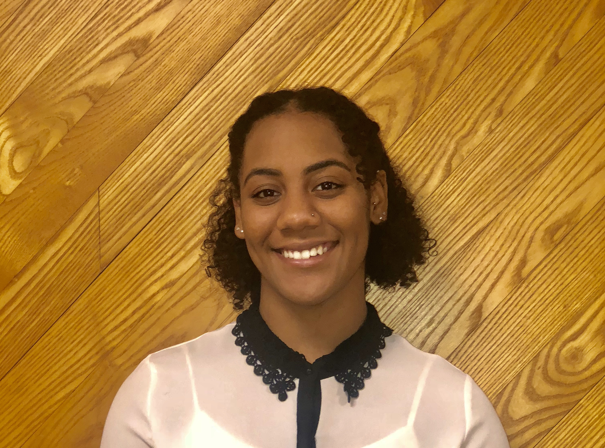

```{r setup, include=FALSE}
knitr::opts_chunk$set(echo = TRUE)
```



## R Labs

* Lab 1: [Introduction to R and Reproducible Research](EvoGeno_Lab1.html)

* Lab 2: [Git, GitHub and Rstudio project](EvoGeno_Lab2.html)

* Lab 3A: [Data Wrangling: Starting with Data ](EvoGeno_Lab3A.html)

* Lab 3B: [Data Wrangling: Manipulating data](EvoGeno_Lab3B.html)


